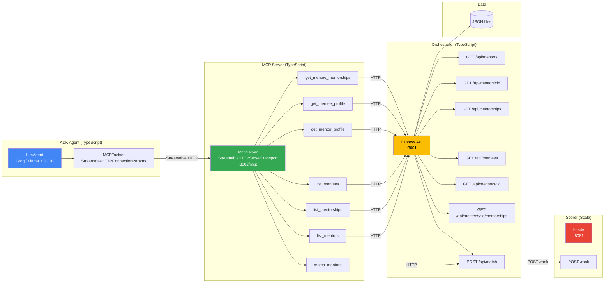
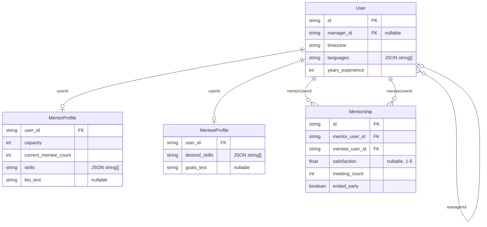

# Mentor-Mentee Matcher

Mentor matching system: Scala scorer + TypeScript orchestrator + MCP server + ADK agent. Ranks mentor candidates for a mentee using structured, semantic, and historical signals.

## Architecture



- **ADK Agent** — Conversational LLM agent using `MCPToolset` to discover and call tools from the MCP server.
- **MCP Server** — Streamable HTTP server (port 3002) exposing 7 tools. Acts as the tool layer between ADK and the Orchestrator.
- **Orchestrator** — Backend service (port 3001) that loads data, pre-filters, computes embeddings, and calls the Scorer.
- **Scorer** — Stateless Scala service (port 8081) that performs structured + semantic + historical scoring.

## Domain model

Raw entities loaded from JSON (`mentor-matching-orchestrator/data/`). 
Full fields: `mentor-matching-orchestrator/src/types/index.ts`.



## Scoring formula

```
totalScore = (Ws × structured + Wm × semantic + Wh × historical) / (Ws + Wm + Wh)
```

**Default main weights:** `Ws = 0.50`, `Wm = 0.30`, `Wh = 0.20`

If a signal is unavailable (e.g., no embeddings → semantic = 0, no history → historical = 0), its weight drops to 0 and the remaining weights re-normalize automatically.

### Structured signal

```
structured = (wTz × timezone + wLn × language + wSk × skills + wEx × expGap + wCp × capacity)
             / (wTz + wLn + wSk + wEx + wCp)
```

| Sub-score | Default weight | How it's calculated |
|-----------|---------------|---------------------|
| timezone | 0.15 | `max(0, 1 − hourDiff/12)` — same timezone = 1.0, 12h apart = 0.0 |
| language | 0.20 | Fraction of mentee's languages the mentor speaks |
| skills | 0.30 | Jaccard similarity between mentor skills and mentee desired skills |
| experienceGap | 0.20 | Sweet spot is 3–8 years senior → 1.0; ≤0 → 0.0; 1–2 → 0.4; 9–15 → 0.7; >15 → 0.5 |
| capacitySlack | 0.15 | `min(slotsRemaining / 3, 1.0)` — more open slots = higher score |

### Semantic signal

```
semantic = cosineSimilarity(menteeGoalsEmbedding, mentorBioEmbedding)
```

Currently uses keyword-based binary vectors; production would use Ollama/OpenAI embeddings.

### Historical signal (requires ≥ 3 past mentorships)

```
historical = (wSat × satisfaction + wRet × retention + wMt × meeting)
             / (wSat + wRet + wMt)
```

| Sub-score | Default weight | How it's calculated |
|-----------|---------------|---------------------|
| satisfaction | 0.50 | `(avgRating − 1) / 4` — normalizes 1–5 rating to 0–1 |
| retention | 0.30 | Fraction of mentorships that did not end early |
| meeting | 0.20 | `min(avgMeetings / 12, 1.0)` — 12 meetings = full score |

### Hard constraints (applied before and after scoring)

- Mentor at full capacity → **excluded**
- Mentor in mentee's reporting chain → **excluded**

## Requirements

- Java 17+, sbt 1.9+ (for scorer)
- Node.js 18+ (for orchestrator, ADK, MCP)

## Structure

```
mentor-mentee-matcher/
├── mentor-matching-scorer/        # Scala 3 HTTP service (port 8081)
├── mentor-matching-orchestrator/  # TypeScript Express (port 3001)
├── mentor-matching-mcp/           # MCP server, Streamable HTTP (port 3002)
├── mentor-matching-adk/           # ADK agent via MCPToolset (port 8000)
└── README.md
```

## Quick start

1. **Start the scorer** (terminal 1)
   ```bash
   cd mentor-matching-scorer && sbt run
   ```
   Wait for the server to listen on port 8081.

2. **Start the orchestrator** (terminal 2)
   ```bash
   cd mentor-matching-orchestrator && npm install && npm run dev
   ```

3. **Start the MCP server** (terminal 3)
   ```bash
   cd mentor-matching-mcp && npm install && npm run build && npm start
   ```
   Serves on http://localhost:3002/mcp.

4. **Start ADK** (terminal 4)
   ```bash
   cd mentor-matching-adk && npm install --ignore-scripts && npm run web
   ```
   Copy `mentor-matching-adk/.env.example` to `.env`, set `GROQ_API_KEY` (free at [console.groq.com](https://console.groq.com)).

5. **Use the agent:** Open http://localhost:8000, select **mentor_matching_agent**, and try:
   - "List all mentors"
   - "Give me the list of mentees"
   - "Tell me about usr_99"
   - "Does usr_99 have previous mentorships?"
   - "Which mentors have mentored before?"
   - "Give me the top 5 mentors recommended for usr_99"
   - "Find mentors for usr_20" (frontend/React mentee)
   - "Find mentors for usr_21" (ML mentee)

6. **Direct API test**
   ```bash
   curl -X POST http://localhost:3001/api/match \
     -H "Content-Type: application/json" \
     -d '{"menteeUserId":"usr_99"}'
   ```

## Stopping services

```bash
for port in 8081 3001 3002 8000; do
  pid=$(lsof -t -i:$port 2>/dev/null)
  [ -n "$pid" ] && kill $pid
done
```

Or use Ctrl+C in each terminal.

## What's included

- **Scorer (Scala):** Pure scoring engine — constraints, structured + semantic + historical signals
- **Orchestrator (TypeScript):** Loads data from JSON, keyword embeddings, pre-filters, calls scorer, exposes REST API
- **MCP Server (TypeScript):** Streamable HTTP server exposing 7 tools: `list_mentors`, `list_mentorships`, `list_mentees`, `get_mentor_profile`, `get_mentee_profile`, `get_mentee_mentorships`, `match_mentors`
- **ADK Agent (TypeScript):** LLM agent using `MCPToolset` with `StreamableHTTPConnectionParams`. Groq (Llama 3.3 70B) via adk-llm-bridge — free tier.

Data lives in `mentor-matching-orchestrator/data/*.json`. Sample data includes 8 mentees and 9 mentors for varied matching demos.

## Troubleshooting

- **Port in use:** Run the stop command above, or `lsof -i :8081` (or 3001, 3002, 8000) to find the PID, then `kill <PID>`.
- **Scorer slow to start:** `sbt run` compiles on first run. Wait for "Server started on port 8081" before testing.
- **MCP connection errors:** Ensure the MCP server is built (`npm run build`) and running on port 3002 before starting ADK.
